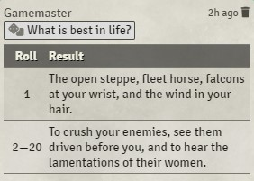
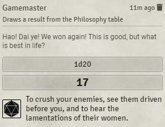
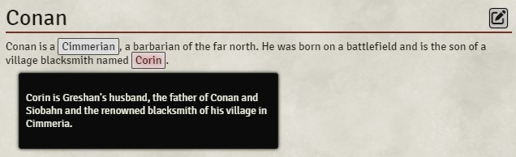
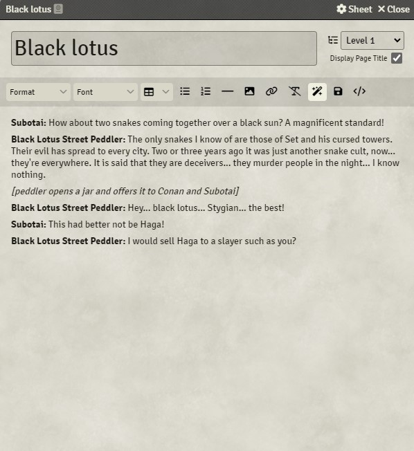
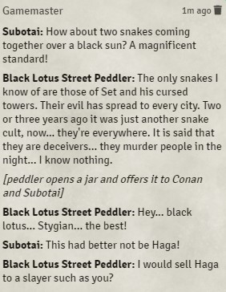

<!-- prettier-ignore -->
# Smart Links

This is a module for Foundry Virtual Tabletop, that allows users to add Dynamic Entity Links for different purposes:

- create a inline link to roll on a RollTable
- create an inline block displaying an embedded document as a tooltip (for instance, display a journal entry as a tooltip)
- create a @Embed-like enricher, allowing to reference a document by its name instead of its UUID.

# Installation

In Foundry VTT, go to Setup screen. Using the `Add-on Modules` tab, import the module using a link to its manifest : `https://github.com/strikehawk/foundryvtt-smart-links/releases/download/latest/module.json`.  
Once module is installed, enable it in your world(s) :

- With the world loaded, go to `Game Settings` in the sidebar, then click on `Manage Modules`.
- Enable module named `Strikehawk's Smart Links`.
- You're ready to go !

# Usage

The so-called "Smart Links" are [enrichers](https://foundryvtt.wiki/en/development/guides/enrichers) adding inline blocks with specific behaviors. Enrichers are supported primarily in Rich Text Editors and Chat log, but might be used elsewhere as well. Smart Links can be used wherever enrichers are executed.

## @SmartRoll : inline button to roll on a RollTable

@SmartRoll allows you to roll on a table on a single click, using an inline button.




Usage examples :

```
@SmartRoll["Philosophy"]{What is best in life ?}
```

Syntax :
`@SmartRoll[<identifier>]{<label>}`

| Element | Description |
| --- | --- |
| `<identifier>` | Mandatory. A string identifying the RollTable to retrieve. It can be a UUID, or the name of the table. Use double quotes when providing the name of the table, to allow spaces in the identifier. |
| `{<label>}` | Optional. A custom label for the inline block. If not present, the name of the document is used. |

## @SmartTooltip : inline block displaying the content of a document as a tooltip



Usage examples :

```
@SmartTooltip[JournalEntry.PhXVYzflEeIT57sS.JournalEntryPage.N8mrLCFac89VnLgv]{Bleeding X}
@SmartTooltip[JournalEntry.PhXVYzflEeIT57sS.JournalEntryPage.N8mrLCFac89VnLgv]
@SmartTooltip["Corin" type="JournalEntry"]
```

Syntax :
`@SmartTooltip[<identifier> type="<type of document>"]{<label>}`

| Element | Description |
| --- | --- |
| `<identifier>` | Mandatory. A string identifying the document to retrieve. It can be a UUID, or the name of a document. If `type` is not specified, `identifier` is assumed to be a UUID. Use double quotes when providing the name of the document, to allow spaces in the identifier. |
| `type="<type of document>"` | Optional. The type of document to retrieve. Supported values for `type` are the keys of the document collections in Foundry : `User`, `Folder`, `Actor`, `Item`, `Scene`, `Combat`, `JournalEntry`, `Macro`, `Playlist`, `RollTable`, `Cards`, `ChatMessage`, `Setting`, `FogExploration`. If `type` is not specified, `identifier` is assumed to be a UUID. |
| `{<label>}` | Optional. A custom label for the inline block. If not present, the name of the document is used. |

## @SmartEmbed : @Embed-like enricher, accepting name in addition to UUID

@SmartEmbed is equivalent to the native [@Embed enricher](https://github.com/foundryvtt/foundryvtt/issues/10262). The only difference is that the name + type can be used to identify the document instead of the UUID.




Usage examples :

```
@SmartEmbed["Hit Location - Humanoid" type="RollTable"]
```

Syntax :
`@SmartEmbed[<identifier> type="<type of document>" caption=<boolean> cite=<boolean> inline=<boolean> classes="<CSS classes to apply to the embedded document>"]`


| Element | Description |
| --- | --- |
| `<identifier>` | Mandatory. A string identifying the document to retrieve. It can be a UUID, or the name of a document. If `type` is not specified, `identifier` is assumed to be a UUID. Use double quotes when providing the name of the document, to allow spaces in the identifier. |
| `type="<type of document>"` | Optional. The type of document to retrieve. Supported values for `type` are the keys of the document collections in Foundry : `User`, `Folder`, `Actor`, `Item`, `Scene`, `Combat`, `JournalEntry`, `Macro`, `Playlist`, `RollTable`, `Cards`, `ChatMessage`, `Setting`, `FogExploration`. If `type` is not specified, `identifier` is assumed to be a UUID. |
| `caption=<boolean>` | Optional. Setting this to `false` will omit the display of the caption. Defaults to `true`. |
| `cite=<boolean>` | Optional. Setting this to `false` will omit the display of the citation. Defaults to `true`. |
| `inline=<boolean>` | Optional. Setting this to `true` will embed the Document's HTML representation directly into the content flow in a `<section>` element rather than a `<figure>`. Using this option will never display a caption or citation. Defaults to `true` (change from @Embed). |
| `classes="<CSS classes to apply to the embedded document>"` | Optional. Any classes supplied here are appended to the outermost element's class list, regardless of whether inline mode is used or not. Defaults to `str-embed`. |